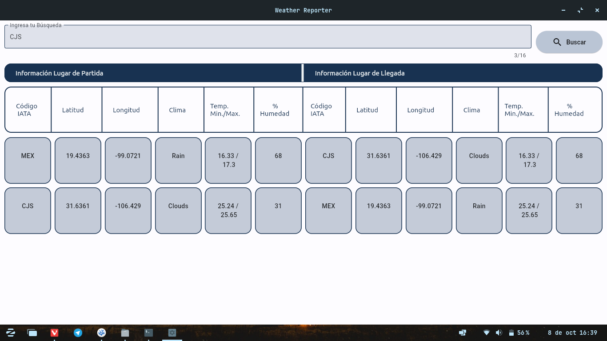
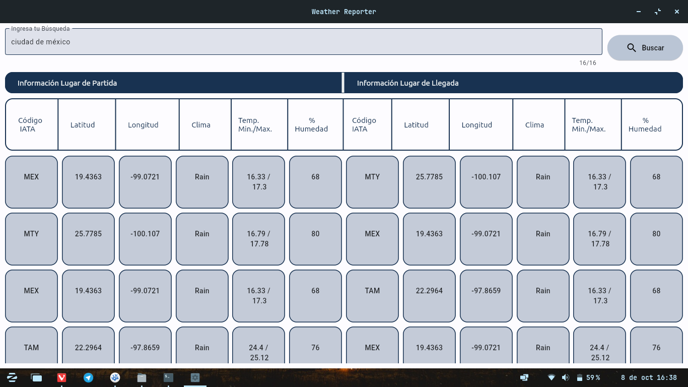
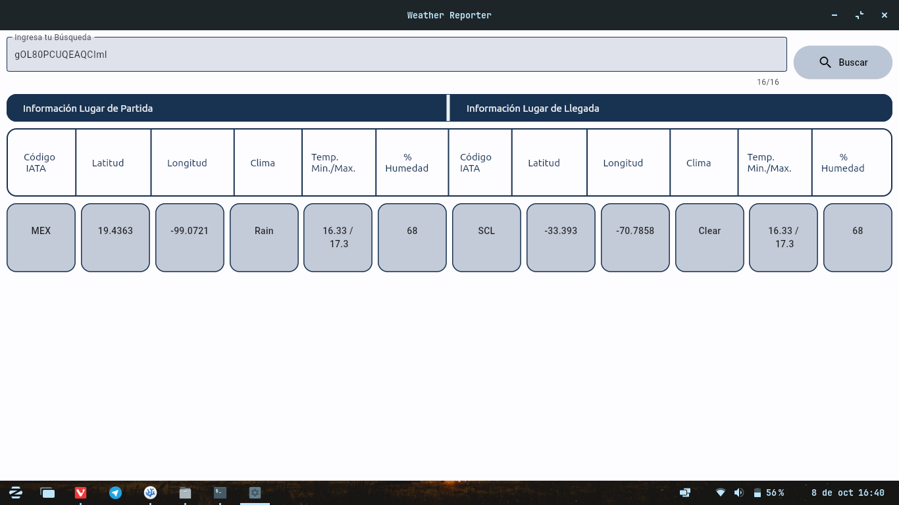

# Proyecto 01 : Reporte del Clima para Aeropuertos


| Alumnos                     | No. de Cuenta |
| --------------------------- | ------------- |  
| González Tamariz Santiago   | 423051416     |
| Paredes Zamudio Luis Daniel | 318159926     |
| Reyes Montelongo Edgar José | 319023275     | 
| Salgado Razo Jonatán        | 417091901     |


## Dependencias 

Primeramente es necesario tener Python y Git instalados en el sistema en sus versiones más recientes. 

La mejor forma de hacerlo es seguir las instrucciones oficiales tanto del lenguaje
de programación como del programa, ambas en sus webs oficiales.

Uno puede instalar Python dando click [aquí](https://www.python.org/downloads/).
Por su lado, las descargas de Git se encuentran en [este enlace](https://git-scm.com/downloads).

Es necesario seguir las instrucciones en pantalla de ambos programas antes de seguir 
con los pasos siguentes.

Ahora se abre una terminal (en Windows puede ser Powershell, en sistemas
Mac y Linux la preferida funciona sin ningun problema) y se introduce línea por línea lo siguiente:

```
 git clone https://github.com/Wallsified/WeatherReport
 cd WeatherReport/ 
```

## Ejecución del Programa

Dependiendo de la plataforma y/o la forma en la que se desee ejecutar el programa, existen dos formas de 
hacerlo:

### Ejecución en Windows mediante Archivo Ejecutable

Anexado al proyecto se incluyes archivos llamados _Weather Reporter-Windows_. Antes de descomprimir el archivo, primero es necesario [desactivar temporalmente Windows Defender](https://support.microsoft.com/es-es/windows/deshabilitar-la-protecci%C3%B3n-antivirus-de-defender-en-seguridad-de-windows-99e6004f-c54c-8509-773c-a4d776b77960). No por que el programa contenga código malicioso, si no que no posee certificados de seguridad (temporalmente).

Posteriormente, se descomprime el archivo y se entra a la carpeta descomprimida resultante. Dentro de esta, la estructura se debe de ver como la siguiente:

```
Weather Reporter - NombreDePlataforma
├── assets
│   ├── dataset2.csv
│   └── name-iata.csv
└── WeatherReporter
```

Es importante que la carpeta _assets_ se mantenga en esa ubicación y no sufra modificaciones, ya que en esta es donde se encuentran los archivos de las bases de datos para el programa. 

El archivo a ejecutar es _WeatherReporter_, basta con darle doble click para poderlo ejecutar.

### Ejecución en Mac / Linux / Terminal (Todas las Plataformas)

Nuevamente ocupando la terminal, y en la carpeta donde se encuentra el proyecto descargado, se realiza lo siguiente: 

```
 python3 -m venv .env
 source /.env/bin/activate
 pip install -r Resources/requirements.txt
```

Una vez realizados los pasos anteriores, basta con ejecutar la siguiente linea en la misma terminal: 

```
flet run GUI/weather_reporter.py
```

## Funcionamiento del Programa

El programa permite buscar de 3 formas diferentes: _Código IATA, Ciudad_ o _Número de Ticket_. Ejemplos de lo anterior se muestran a continuación: 

### Búsqueda por Código IATA



### Búsqueda por Ciudad



### Búsqueda por Número de Ticket



## Notas a la Ejecución

- Al ejecutar el programa por primera vez se crea el caché de los resultados por lo que es normal esperar unos cuantos segundos para mostrar el resultado. Posteriormente al crear nuevas búsquedas los resultados se muestran de manera más inmediata (según la cantidad de resultados, puede variar entre 2-8 segundos aproximadamente.) 

- Al buscar por Código IATA o por ciudad es normal ver múltiples resultados. Para poder observarlos basta con hacer _scroll_ dentro de la sección de resultados.  

## Proceso de solución del problema

### Análisis del Problema

Se requiere crear una aplicación para consultar el clima en el lugar de salida/destino de un vuelo de avión. 

El usuario debe poder realizar búsquedas dentro de la misma mediante número de ticket, ciudad o código IATA, por lo que se requiere una interfaz gráfica para su funcionamiento. 

Debido a la diversidad de usuarios, se busca que la aplicación este disponible en diferentes plataformas. 

### Datos Disponibles 

Se cuenta con un dataset de los vuelos el cual contiene el no. de ticket, códigos IATA de salida/destino y sus coordenadas (latitud, longitud).

Nos hacen falta los datos del clima, los cuales obtendremos mediante consultas un WebService.

### Herramientas Elegidas

Se eligió Python como lenguaje de programación para resolver el problema debido a su facilidad de comprender y mantener, su característica de ser multiparadigma y las librerías tanto gráficas como de funcionalidad que se pueden ocupar para resolver de forma más fácil la enconmienda.

Usaremos Flet como la librería gráfica principal, la cual, al estar basada en Flutter y los patrones de diseño Material Design de Google, nos permitirán crear una interfaz moderna a la vista y con estilos que la mayoría de usuarios ya están acostumbrados.

Se usará la API de OpenWeather para la obtención de los datos del clima, esto debido tanto a la gran cantidad de datos disponibles que se pueden obtener de la misma y a la posibilidad de consultar de la misma de manera gratuita hasta cierto extento. 

### Modelo de Datos

Los datos recibidos de la API se procesaran en formato JSON para su fácil comprensión y posterior manipulación.

Se implementará un sistema de cache de clima para agilizar el proceso y que el acceso de datos sea mucho
más rápido. El cache guardará los datos de clima de un lugar y a la hora de consultar el clima de un
lugar se checará primero el cache para evitar llamar a la api (que aparte de ser mucho más lento tiene un límite de llamadas por tiempo).

Se obtendrá la entrada del usuario la cuál podrá ser un no. de ticket, IATA o nombre de ciudad - aeropuerto. Una vez obtenida la información se obtendrán las coordenadas del lugar correspondiente para poder obtener el clima del lugar.

### Pseudocódigo

Este puede verse con más detalle en el archivo [correspondiente.](/Reports/Pseudocode.pdf)

## Presentación del Proyecto

De igual manera puede verse con más detalle en su archivo [correspondiente.](/Reports/Weather%20Reporter%20Presentation.pdf)
